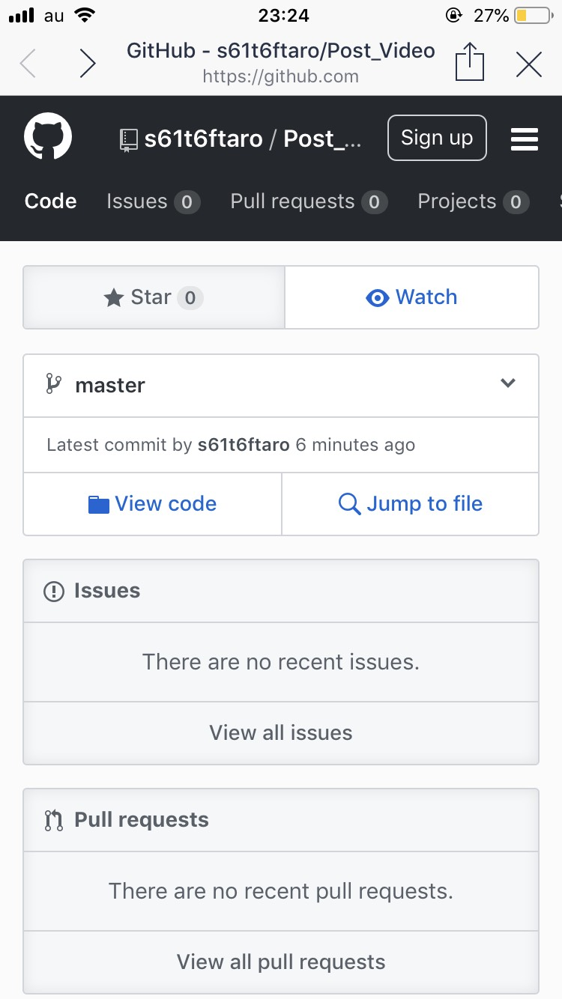
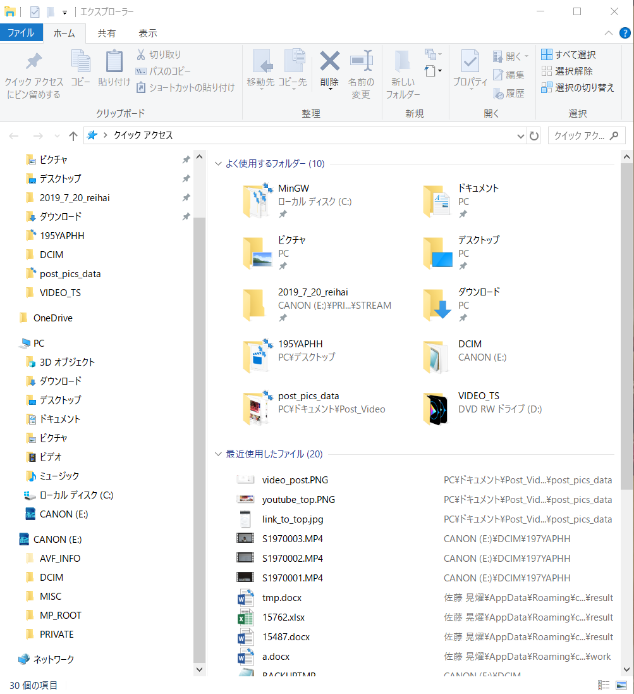
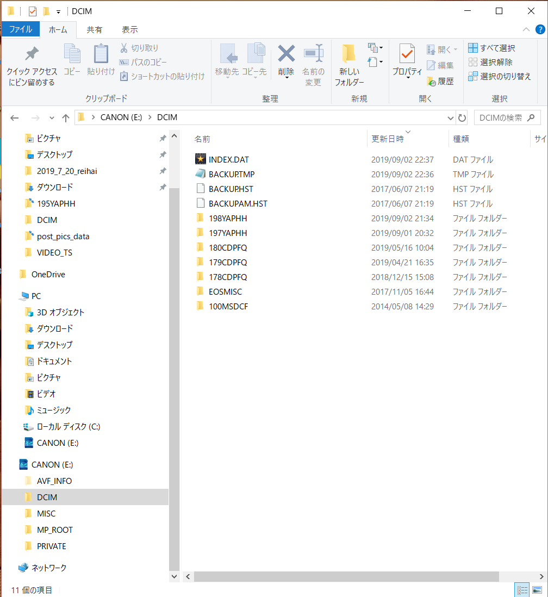
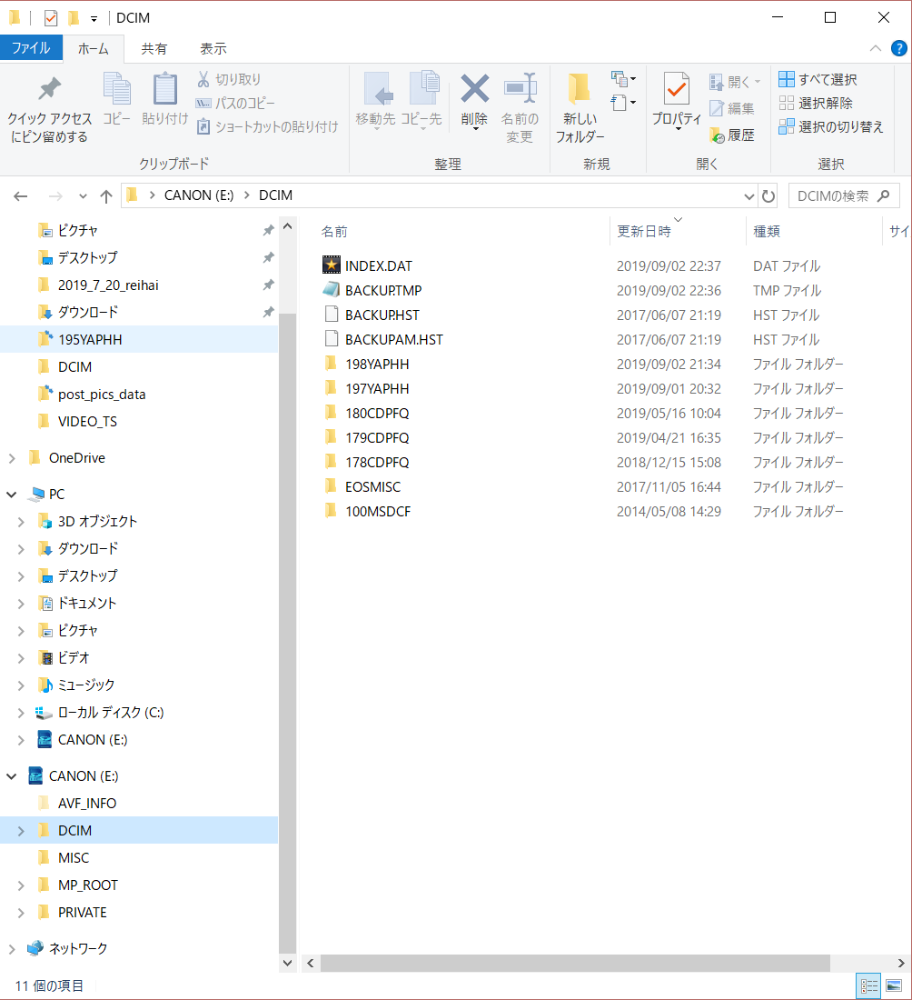
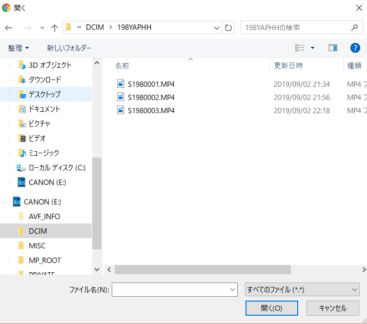
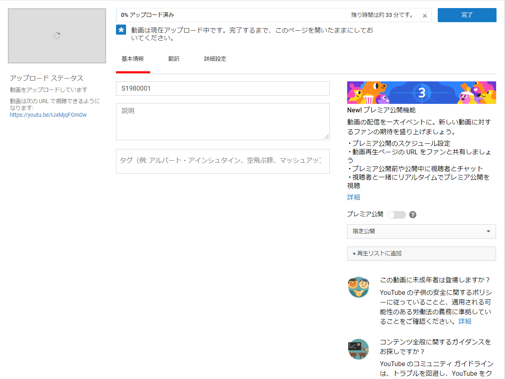
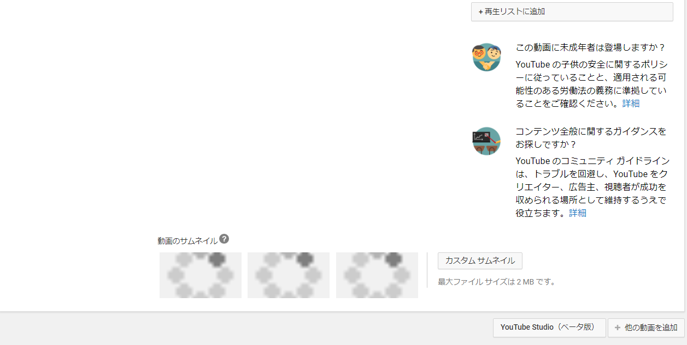
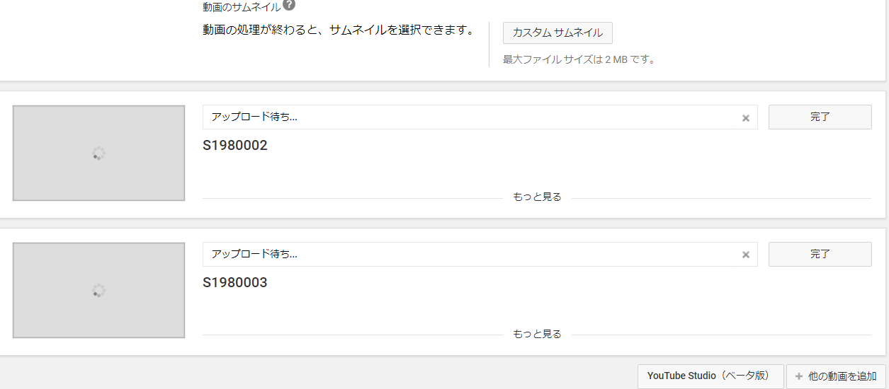

># Youtubeへ動画の投稿の仕方

# 最初に

まずはじめに、このサイトが見れるURLを送ったのでそこから説明していきます。

これはざっくり簡単にいうとIT系のブログみたいな物と捉えてください。 
※外国のサイトなので基本的に英語です 
このページから次へ行くために今度は**View code**というリンクを押します 
 

新しいページに飛んだと思います。 
そしたらそこに記載されている説明文を読むことができます。

# やること１

## 投稿する場所の確認とアカウント管理

まず動画を投稿するサイトYoutubeを開きよく見る画面を出します。 
次に、動画を投稿するということはその動画を投稿した後編集したり削除したりしますよね？ 
それらをするためには**アカウント**が必要になります。 
ですので、作っていない方はアカウント **（Google)** 作ってください。

それではアカウントを既に持っている方はYutube**画面右上**にあるアカウントマークにちゃんと自分のアカウントがログインできているか確認します

 

 

できたら早速動画を投稿していきましょう。
同じく画面右上にある**ビデオカメラマークに「＋」がついたアイコン**をクリックします。 
すると下の画像ようなメニューが出ます。 
そのメニューの「**動画をアップロード**」を押し動画投稿画面へ移動したこと確認してください。

この画面が動画を投稿する画面です。覚えてください。

# やること２

## 動画を投稿するデータを確認する

pc、SDカード、USBなどに入っているデータを確認します。 
デスクトップアイコンクリックして投稿したいデータを確認しましょう。 
SDカードが読み込まれるとPCのローカルディスクの下に表示されます

それではSDカードCANONのDCIMフォルダを開きデータを確認しましょう。 
ここに動画のデータが入っています。 
よくわからない名前のフォルダがいっぱいありますね。 
どれがいつのデータかわからない時は日付を見て探しましょう。 
今回は最新9/2のデータのフォルダは**18YAPHH**フォルダに投稿したい動画が入ってます。

 

# やること３
## データを確認できたのでさっそく投稿してみよう

先ほどのYoutube投稿画面からまず投稿する動画は**公開**なのか**限定公開**なのか**非公開**なのか**公開予約**なのか選びます。 
今回は最初の2つだけ説明します。 
**公開**は一般に誰でも見れる状態のことで、**限定公開**とは投稿した時に作られる**URL**を持っている人じゃないと見れない状態のことです
それでは**限定公開**で投稿していきましょう。 
「アップロードファイルを選択」をクリックします

 

 

するとさきほどのデスクトップの画面がでるので、投稿したいデータが入っている場所に移動します。 
※今回はCANONのDCIMの中の18YAPHHです。

 

 

さっそくこの３つを選択し投稿していきます。 
選択して「開く」くを押します。 
※どれが最初の動画なのかわからないときも日付日時をみましょう。

 

開くとこのような画面になります。 
これが投稿中の基本的な画面になります覚えておきましょう。 
上から順にタイトル、説明、タグです。
※基本すぎるのでこれらの説明は省きます。
これで必要項目を入力して動画がアップロードするのを待つだけです。 
完了した後にタイトルなど編集したい場合もこの画面で簡単にできます。 

まだ投稿したい動画があるのにこの1つが終わるまで待たないといけないの？ 
と思うかもしれません。大丈夫です投稿したい動画をいっぺんにアップロードすることもできます。 
この画面の一番下に行きましょう。一番右下に他の「動画を追加」というボタンがあります。 これで投稿したい動画を追加していってまとめてみることが出来ます。 
※先ほどと同じように投稿してみましょう。 
ちゃんどまとめてアップロードできましたね。基本的なやりかたはおしまいです。 
すべて完了したら完了を押して生成されたURLを使いましょう。

 

# 最後に

限定公開の場合URLが生成されますがアップロード終わるまでURLわからないの？とよく聞かれますが、実は左アップロード画面左に青文字でURLが出来ています。 
忙しいときはこれを使いましょう。 
※どのみちアップロードが終わらないとURLに飛んでも動画はみれません

